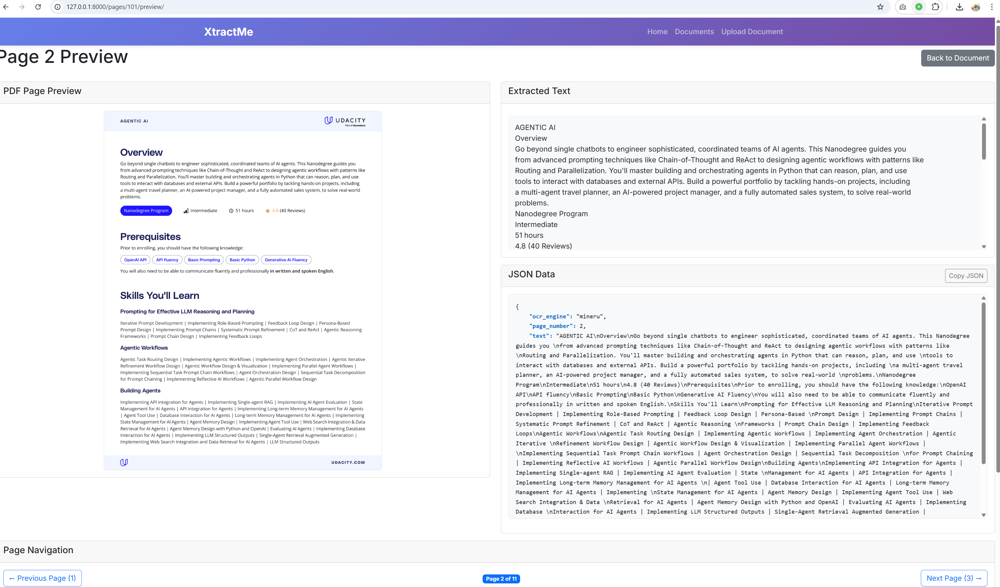

# xtractme
Document Extraction with Django

A Django-based document extraction and OCR application with support for multiple OCR engines including MinerU, OLMOCR, Tesseract, DeepSeek OCR, PaddleOCR, TrOCR, Donut, and more.

## Screenshot



## Prerequisites

- Python 3.8 or higher
- pip (Python package manager)
- Tesseract OCR (optional, for Tesseract OCR support)
- Git (for cloning the repository)

**Optional but Recommended:**
- NVIDIA GPU with 12GB+ VRAM (for GPU-accelerated OCR engines like OLMOCR, PaddleOCR)
- 30GB+ free disk space (for model downloads and OCR engines)
- CUDA toolkit (for GPU support with PyTorch-based engines)

## Quick Start

### 1. Activate Virtual Environment

The project includes a virtual environment. Activate it:

**Windows (PowerShell):**
```powershell
.\venv\Scripts\Activate.ps1
```

**Windows (Command Prompt):**
```cmd
venv\Scripts\activate.bat
```

**Linux/Mac:**
```bash
source venv/bin/activate
```

### 2. Install Dependencies

If dependencies are not already installed, install them:

```bash
pip install -r requirements.txt
```

**Note:** Some dependencies (like PyTorch, PaddleOCR, OLMOCR) are large and optional. Install only what you need.

**Optional OCR Engine Installations:**
- **MinerU** (default): Already in requirements.txt
- **OLMOCR**: See OLMOCR Setup section below (commented in requirements.txt)
- **PaddleOCR**: `pip install paddlepaddle paddleocr`
- **TrOCR/Donut**: Requires `torch` and `transformers` (already in requirements.txt)
- **Tesseract**: Requires system installation (see Tesseract OCR Setup below)
- **DeepSeek OCR**: Optional - can use API mode instead

### 3. Set Up Environment Variables (Optional)

Create a `.env` file in the project root for custom configuration:

```env
SECRET_KEY=your-secret-key-here
DEBUG=True
ALLOWED_HOSTS=localhost,127.0.0.1
DEEPSEEK_OCR_API_URL=http://localhost:8001
DEEPSEEK_OCR_USE_API=True
OLMOCR_ENABLED=True
OLMOCR_USE_API=False
OLMOCR_API_URL=https://api.olmocr.com
OLLAMA_MODEL=qwen3:4b
OLLAMA_HOST=http://localhost:11434
LOG_LEVEL=INFO
```

If you don't create a `.env` file, the project will use default values from `settings.py`.

### 4. Run Database Migrations

Apply database migrations:

```bash
python manage.py migrate
```

### 5. Create Admin User (Optional)

If you need to create an admin user:

```bash
python manage.py createsuperuser
```

Or use the simple script:
```bash
python create_admin_simple.py admin admin123 admin@example.com
```

### 6. Collect Static Files

Collect static files for the admin interface:

```bash
python manage.py collectstatic --noinput
```

### 7. Run the Development Server

Start the Django development server:

```bash
python manage.py runserver
```

The server will start at `http://localhost:8000/`

### 8. Access the Application

- **Admin Panel:** http://localhost:8000/admin/
- **Main Application:** http://localhost:8000/

## Project Structure

- `core/` - Main Django app with document extraction logic
- `myproject/` - Django project settings
- `media/` - Uploaded documents storage
- `static/` - Static files
- `staticfiles/` - Collected static files
- `docs/` - Project documentation
- `schemas/` - JSON schemas for validation

## Features

- **Multiple OCR Engines Support**:
  - **MinerU** - Advanced document understanding with layout detection (default)
  - **OLMOCR** - AI-powered OCR by Allen Institute for AI (local or API)
  - **Tesseract OCR** - Traditional OCR engine
  - **DeepSeek OCR** - API-based OCR with Ollama support
  - **PaddleOCR** - PaddlePaddle OCR with layout extraction
  - **TrOCR** - Transformer-based OCR
  - **Donut** - Document Understanding Transformer
  - **PyMuPDF** - Direct PDF text extraction
  - **pdfplumber** - PDF text extraction library
  
- **JSON Data Extraction**: Structured JSON data from all OCR engines
- **Document Upload and Processing**: Support for PDFs and images
- **Page-by-Page Processing**: Extract and view individual pages with JSON data
- **JSON Schema Validation**: Define and validate extraction schemas
- **Modern Django Admin Interface**: UnfoldAdmin theme
- **LLM Integration**: Ollama integration for document analysis
- **PDF Processing**: Full PDF support with PyMuPDF

## Additional Setup (Optional)

### Tesseract OCR Setup

For Tesseract OCR support, install Tesseract:

**Windows:**
- Download from: https://github.com/UB-Mannheim/tesseract/wiki
- Add to PATH

**Linux:**
```bash
sudo apt-get install tesseract-ocr
```

**Mac:**
```bash
brew install tesseract
```

### DeepSeek OCR Setup

See `docs/DEEPSEEK_OCR_SETUP.md` for detailed instructions.

### MinerU Setup

See `docs/MINERU_SETUP.md` for detailed instructions.

### OLMOCR Setup

OLMOCR is an AI-powered OCR tool by Allen Institute for AI. It can be used in two modes:

#### Local Installation (Recommended)

**System Requirements:**
- Ubuntu/Debian (Linux)
- NVIDIA GPU with 12GB+ VRAM (recommended) or CPU-only
- 30GB+ free disk space

**Installation Steps:**

1. Install system dependencies (Ubuntu/Debian):
   ```bash
   sudo apt-get update
   sudo apt-get install poppler-utils ttf-mscorefonts-installer msttcorefonts \
       fonts-crosextra-caladea fonts-crosextra-carlito gsfonts lcdf-typetools
   ```

2. Install OLMOCR with GPU support:
   ```bash
   pip install olmocr[gpu] --extra-index-url https://download.pytorch.org/whl/cu128
   ```

   Or for CPU-only (slower):
   ```bash
   pip install olmocr
   ```

3. Configure in Django Settings:
   - `OLMOCR_ENABLED=True` (default)
   - `OLMOCR_USE_API=False` (default - uses local installation)
   - Or configure via Django Admin → Settings → OLMOCR Settings

#### API Mode

If you prefer to use OLMOCR via API:

1. Set environment variables:
   ```env
   OLMOCR_ENABLED=True
   OLMOCR_USE_API=True
   OLMOCR_API_URL=https://api.olmocr.com
   ```

2. Or configure via Django Admin → Settings → OLMOCR Settings

**Note:** OLMOCR works best with GPU acceleration. CPU-only mode is supported but slower.

### Ollama Setup (for LLM features)

1. Install Ollama from: https://ollama.ai
2. Pull the model:
   ```bash
   ollama pull qwen3:4b
   ```
3. Start Ollama server (usually runs automatically)

## OCR Engines Comparison

| Engine | Best For | Local Install | API Support | JSON Data | Layout Detection |
|--------|----------|---------------|-------------|-----------|------------------|
| **MinerU** | Academic papers, complex layouts | ✅ Yes | ❌ No | ✅ Full | ✅ Advanced |
| **OLMOCR** | General documents, AI-powered | ✅ Yes | ✅ Yes | ✅ Yes | ✅ Yes |
| **Tesseract** | Simple text extraction | ✅ Yes | ❌ No | ✅ Basic | ❌ No |
| **DeepSeek OCR** | API-based OCR | ⚠️ Optional | ✅ Yes | ✅ Basic | ❌ No |
| **PaddleOCR** | Text with layout info | ✅ Yes | ❌ No | ✅ Layout | ⚠️ Basic |
| **TrOCR** | Printed text | ✅ Yes | ❌ No | ✅ Basic | ❌ No |
| **Donut** | Structured documents | ✅ Yes | ❌ No | ✅ Yes | ✅ Yes |
| **PyMuPDF** | PDFs with text layer | ✅ Yes | ❌ No | ✅ Basic | ❌ No |
| **pdfplumber** | PDFs with text layer | ✅ Yes | ❌ No | ✅ Basic | ❌ No |

## Troubleshooting

- **Import errors:** Make sure virtual environment is activated and dependencies are installed
- **Database errors:** Run `python manage.py migrate`
- **Static files not loading:** Run `python manage.py collectstatic`
- **OCR not working:** Check that required OCR engines are properly installed
- **OLMOCR errors:** 
  - Ensure system dependencies are installed (Ubuntu/Debian)
  - Check GPU availability if using GPU mode: `nvidia-smi`
  - For CPU-only: `pip install olmocr` (without `[gpu]`)
  - Verify OLMOCR installation: `python -m olmocr.pipeline --help`
- **JSON data not appearing:** 
  - JSON data is automatically created for all OCR engines
  - Check the "JSON Data" section in page detail view
  - Verify the OCR engine supports JSON output (all engines create at least basic JSON)

## Usage

### Uploading and Processing Documents

1. **Upload Document**: Go to the main application page or Django admin
2. **Select OCR Engine**: Choose from available OCR engines in the dropdown
3. **Process**: Document will be automatically processed page-by-page
4. **View Results**: 
   - Access extracted text in the page detail view
   - View structured JSON data in the "JSON Data" section
   - Preview pages with PDF viewer and JSON side-by-side

### JSON Data

All OCR engines now generate JSON data with:
- `ocr_engine`: The engine used for extraction
- `page_number`: Page number
- `text`: Extracted text content
- `has_ocr`: Whether OCR was used (vs direct text extraction)
- `extraction_method`: 'ocr' or 'direct'
- `page_width` and `page_height`: Page dimensions
- Additional engine-specific structure (blocks, bounding boxes, etc.)

Advanced engines (MinerU, OLMOCR, PaddleOCR) provide additional structured data:
- Layout information (blocks, headings, paragraphs, tables)
- Bounding box coordinates
- Element types and hierarchy
- Confidence scores

## Documentation

See the `docs/` folder for detailed documentation:
- `ADMIN_SETUP.md` - Admin user setup
- `MINERU_SETUP.md` - MinerU installation guide
- `DEEPSEEK_OCR_SETUP.md` - DeepSeek OCR setup
- `PROJECT_STRUCTURE.md` - Project structure details
- `MINERU_JSON_FEATURE.md` - JSON data extraction features
- `LAYOUT_EXTRACTION_GUIDE.md` - Working with layout data

## License

[Add your license information here]
